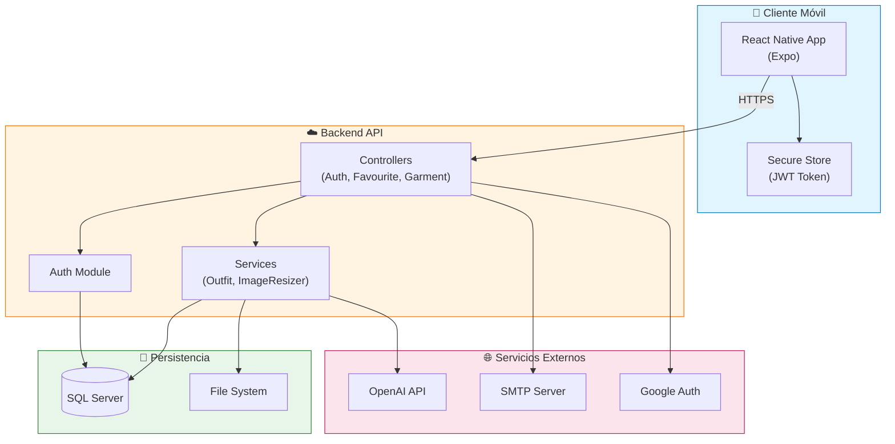
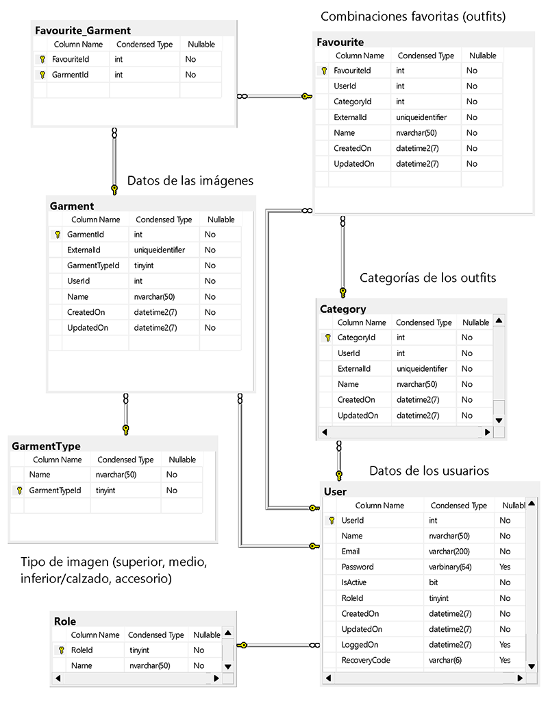
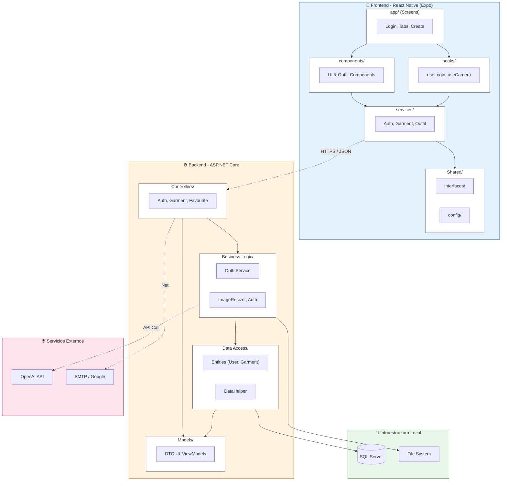
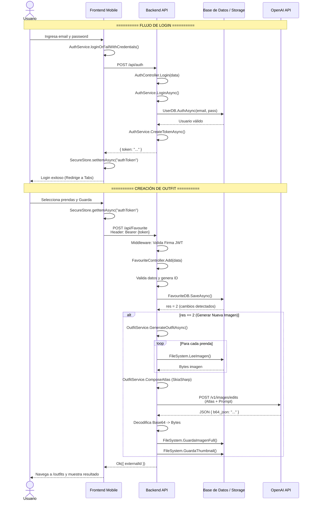

# Proyecto: StyleMatch

## Descripción

**StyleMatch** es una aplicación móvil desarrollada en el marco de la materia _Desarrollo de Aplicaciones I_ de la **Universidad Argentina de la Empresa (UADE)**.  
Su propósito es brindar a los usuarios una forma innovadora de gestionar y combinar sus prendas de ropa mediante el uso de la cámara del dispositivo, logrando que el proceso de elegir qué ponerse sea más simple, organizado y creativo.

Con **StyleMatch** podés:

- Capturar fotos de tus prendas para construir tu propio guardarropa digital.
- Generar combinaciones únicas de outfits, potenciando tu creatividad y estilo personal.
- Guardar tus outfits favoritos para un acceso rápido.
- Organizar tus combinaciones dentro de categorías específicas según la ocasión o preferencia.

De esta manera, la aplicación no solo busca resolver el problema cotidiano de “qué me pongo”, sino también ofrecer una experiencia atractiva, accesible y personalizada, pensada para mejorar la vida diaria de los usuarios y acompañarlos en su expresión de estilo.

## Arquitectura



## DER (Diagrama Entidad-Relación)



## Diagrama de paquetes



## Diagrama de secuencia



## Tecnologías Utilizadas

- **Frontend – React Native:** Se eligió por ser un framework híbrido que permite el desarrollo multiplataforma con una única base de código. La mayoría del equipo posee experiencia previa en **React**, lo que agiliza la curva de aprendizaje y acelera el desarrollo.
- **Backend – .NET:** La elección de **.NET** se fundamenta en la experiencia previa del equipo en el ecosistema Microsoft, lo que facilita la implementación de buenas prácticas y optimiza los tiempos de desarrollo. Además, ofrece un excelente manejo de memoria y rendimiento, características clave para aplicaciones que requieren escalabilidad.
- **Base de Datos – SQL Server:** Se seleccionó **SQL Server** por tratarse de un sistema de base de datos relacional robusto, ampliamente utilizado en entornos académicos y empresariales. Su integración con el ecosistema Microsoft facilita la administración y asegura la confiabilidad e integridad de los datos.
- **Gestión de Proyecto – Jira:** Se utilizó **Jira** por ofrecer un servicio gratuito adecuado al alcance del proyecto. Su interfaz es intuitiva y permite un seguimiento ágil y claro de las tareas.
- **Control de Versiones – GitHub:** Se seleccionó **GitHub** por ser una plataforma ampliamente adoptada en la industria, con integración nativa a múltiples herramientas de CI/CD. Permite un control de versiones confiable, colaboración fluida entre los integrantes del equipo y trazabilidad completa del desarrollo.

## Plan de pruebas:

[Plan de Pruebas - DAI.pdf](./diagramas/Plan%20de%20Pruebas%20-%20DAI.pdf)

## Instalación y Ejecución

### Prerrequisitos

Antes de comenzar, asegurate de tener instalado:

- [Node.js](https://nodejs.org/) (versión recomendada: **LTS**)
- [npm](https://www.npmjs.com/) o [yarn](https://yarnpkg.com/) como gestor de paquetes
- [Expo Go](https://expo.dev/client) en tu dispositivo móvil (disponible en Google Play y App Store) para probar la app de forma rápida

### Pasos de instalación

1. Cloná el repositorio en tu máquina local:
   ```bash
   git clone https://github.com/nicopenaloza/style-match-dai.git
   cd style-match-dai
   ```
2. Instalá las dependencias del proyecto

```bash
  npm install
```

3. Iniciá el servidor de desarrollo

```bash
  npm start
```

4. Iniciá el emulador de Android (debes tener Android Studio instalado).

```bash
    a
```

En el caso de querer probar la aplicación con iOS podrá utilizar

```bash
    i
```

Y en el caso de querer probarla en la web, puede utilizar

```bash
    w
```

### Pasos de creación de APK.

1. Ejecute el siguiente comando en la raíz del proyecot.

```bash
  npx expo prebuild
```

1. Ingrese a /android.

```bash
  cd android
```

3. Genere el APK con

```bash
    ./gradlew assembleRelease
```
